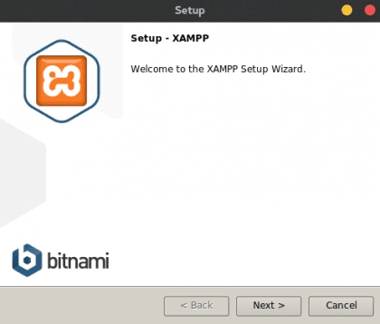
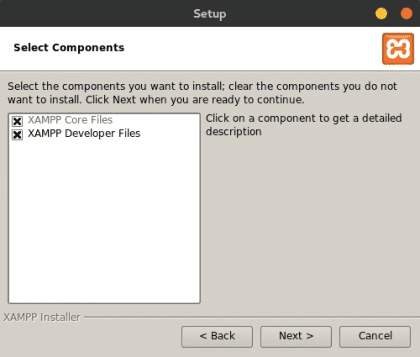

# Instalación

El programa Xandra está basado en python3 y su interfaz grafica utiliza como motor PyQt5, por otro lado, la persistencia de datos se realiza mediante MySQL cuyo motor es gestionado por XAMPP.

Como puede observarse se tienen múltiples dependencias para la ejecución de Xandra por lo que es necesario realizar la instalación de cada una de ellas para poder ejecutar el programa principal.

## Instalar XAMPP

XAMPP es una distribución de Apache completamente gratuita y fácil de instalar que contiene MariaDB, PHP y Perl. El paquete de instalación de XAMPP ha sido diseñado para ser increíblemente fácil de instalar y usar.

Para instalar ésta distribución realiza los siguientes pasos:

* Descarga XAMPP para Linux desde [https://www.apachefriends.org/es/index.html](https://www.apachefriends.org/es/index.html)
* Al terminar la descarga nos queda un archivo .run, que debemos instalar de la siguiente manera (donde xxx es la versión del archivo descargado):
   
``` shell
$ sudo su
$ chmod +x xampp-linux-x64-xxx-installer.run
$ ./xampp-linux-x64-xxx-installer.run
```



* Aceptamos todo y esperamos a que termine la instalación.

## Crear servicio de XAMPP

Systemd es un sistema init y un administrador del sistema  considerado como el estándar para las distribuciones Linux por lo tanto es el contenido por defecto en CentOS.

La finalidad principal de un sistema init es inicializar los componentes que deben ejecutarse tras arrancar el kernel Linux (tradicionalmente conocidos como componentes “userland”). El sistema init también se utiliza para administrar servicios y daemons para el servidor en cualquier momento mientras se ejecuta el sistema.

Para crear el servicio del paquete XAMPP es necesario realizar los siguientes pasos:

* Acceder a la carpeta contenedora de los servicios y crear un nuevo archivo llamado `xampp.service`:

``` shell
$ cd /etc/systemd/system/
$ touch xampp.service
$ gedit xampp.service
```

* Dentro del archivo `xampp.service` agregar la siguiente información:

```
[Unit]
Description = Xampp server

[Service]
ExecStart =/opt/lampp/lampp start
ExecStop =/opt/lampp/lampp stop
Type=forking
  
[Install]
WantedBy = multi-user.target
```

* Guardar los cambios del archivo `xampp.service`.
* Habilitar el servicio para que XAMPP sea inicializado automáticamente en el arranque:

``` shell
$ systemctl enable xampp.service
```

* Iniciar el servicio y validar que todo se ha inicializado correctamente:

``` shell
$ systemctl start xampp.service
$ systemctl status xampp.service
```

Debe mostrar una salida similar a la siguiente:

```
XAMPP: Starting Apache.../opt/lampp/share/xampp/xampplib
/opt/lampp/share/xampp/xampplib
ok.
XAMPP: Starting MySQL.../opt/lampp/share/xampp/xampplib
ok.
XAMPP: Starting ProFTPD.../opt/lampp/share/xampp/xampplib
ok.
```

> ⚠ **Si aparece un error relacionado con libc.so** ve al apartado __Solución de errores__ para solucionarlo.


## Crear base de datos

La base de datos es el componente principal de persistencia de datos utilizado por Xandra, en éste se almacenan los resultados de las pruebas realizadas así como la configuración y el estado de cada fixtura.

Para crear la base de datos `xandra_dbo` ejecuta los siguientes comandos:

``` shell
$ /opt/lampp/bin/mysql -u root
```

Se iniciara la consola de `MariaDB` y mostrara una información similar a la siguiente:

```
Welcome to the MariaDB monitor.  Commands end with ; or \g.
Your MariaDB connection id is 9
Server version: 10.4.27-MariaDB Source distribution

Copyright (c) 2000, 2018, Oracle, MariaDB Corporation Ab and others.

Type 'help;' or '\h' for help. Type '\c' to clear the current input statement.

MariaDB [(none)]> 
```

Introduce el siguiente comando para crear el esquema `xandra_dbo`:

``` sql
CREATE DATABASE IF NOT EXISTS xandra_dbo;
```

Si la respuesta es semejante a la que se muestra a continuación, el procedimiento fue realizado correctamente:

```
MariaDB [(none)]> CREATE DATABASE IF NOT EXISTS xandra_dbo;
Query OK, 1 row affected (0.039 sec)
```


## Instalar dependencias del sistema

Xandra tiene dependencias externas relacionadas con el sistema operativo, las mismas son instaladas mediante el gestor de paquetes propio de CentOS, es decir, yum.

Para instalar dichas dependencias es necesario contar con una conexión estable a internet debido a que los repositorios en los que se encuentran alojados sólo son accesibles a través de éste medio.

Para instalar las dependencias del sistema ejecuta los siguientes comandos:

``` shell
sudo yum install -y tmux xterm
```

## Agregar comandos alias al sistema

Los alias son similares, salvando las distancias, a los accesos directos de Windows. Permiten representar un comando (o conjunto de comandos) ejecutados con o sin opciones personalizadas.

Los alias permiten reemplazar un comando o serie de comandos con otros personalizados. Su uso principal es el de abreviar órdenes o también para añadir argumentos de forma predeterminada a una orden que se usa con mucha frecuencia.

Para agregar los alias de Xandra realice los siguientes comandos:

* Modificar archivo `~/.bashrc`:
``` shell
gedit ~/.bashrc
```

* Agregar lo siguiente al final del archivo `~/.bashrc`:

``` shell
if [ -f ~/.bash_aliases ]; then
. ~/.bash_aliases
fi
```

* Guardar los cambios.

* Crear archivo `~/.bash_aliases`:
   
``` shell
$ touch ~/.bash_aliases
$ gedit ~/.bash_aliases
```
* Agregar lo siguiente en el archivo:
```
# Alias to open Xandra
alias xandra='tmux new -d "cd /usr/local/Foxconn/automation/Xandra && python3 /usr/local/Foxconn/automation/Xandra/xandra.py"'

# Alias to open Xandra in testing mode
alias xandra-testing='ENV=testing python3 /usr/local/Foxconn/automation/Xandra/xandra.py'

# Alias to open Xandra config
alias xandra-config='tmux new -d "gedit /usr/local/Foxconn/automation/Xandra/xandra_config.json"'

# Alias to cd Xandra path
alias xandra-path='cd /usr/local/Foxconn/automation/Xandra'

# Alias to update Xandra
alias xandra-update='chmod +x /usr/local/Foxconn/automation/Xandra/update.sh && /usr/local/Foxconn/automation/Xandra/update.sh'
```
* Guardar los cambios.
  
* Reiniciar la terminal para poder ejecutar los comandos.
   
> ⚠ La lista completa de comandos se puede consultar en la sección **Comandos**.

## Clonar repositorio de Github

El proyecto Xandra se encuentra alojado en el servidor Github.com para facilitar la gestión de versiones y la distrubución del mismo.

Clonar un repositorio extrae una copia integral de todos los datos del repositorio que GitHub.com tiene en ese momento, incluidas todas las versiones de cada archivo y carpeta del proyecto.

Para clonar el programa Xandra a la computadora local ejecute los siguientes comandos:

```
$ mkdir /usr/local/Foxconn/automation
$ cd /usr/local/Foxconn/automation
$ git clone https://github.com/David1906/Xandra.git
```

## Instalar dependencias python

Pip es un sistema de gestión de paquetes utilizado para instalar y administrar paquetes de software escritos en Python. Xandra hace uso de dichos paquetes para enriquecer su funcionalidad proveyendolo de características tales como una interfaz gráfica.

Para instalar las dependencias de python ejecute los siguientes comandos:

```
$ pip3 install -r requirements.txt
$ pip3 uninstall alembic
$ python3 -m pip install alembic --user
```

## Crear acceso directo

En Gnu/Linux es fácil crear accesos directos personalizados que estén registrados por el escritorio y que los muestre en donde corresponda de manera automática, para ello solo hemos de crear un archivo .desktop dentro de la carpeta correspondiente.

En el caso de xandra discho acceso directo se crea en la carpeta Desktop del usuario root, para ello realice los siguientes pasos:

* Ejecutar en una terminal los comandos:

```
$ touch /root/Desktop/xandra.desktop
$ gedit /root/Desktop/xandra.desktop
```

* Agregar lo siguiente en el archivo:

```
[Desktop Entry]
Name=Xandra
Exec=tmux new -d "cd /usr/local/Foxconn/automation/Xandra && python3 /usr/local/Foxconn/automation/Xandra/xandra.py"
Terminal=true
Type=Application
Icon=/usr/local/Foxconn/automation/Xandra/Static/icon.png
```

* Guardar los cambios.

Una vez realizados los pasos anteriores debe aparecer un acceso directo en el escritorio del usuario root con el ícono de Xandra.

> ⚡Tip: también es posible abrir el programa Xandra ejecutando el comando `xandra` en una terminal.


## Correr script de actualización

Xandra cuenta con un script especializado en buscar, descargar y configurar las nuevas versiones lanzadas del mismo, para ello basta con ejecutar el comando `xandra-update` en una terminal.

```
$ xandra-update
```

## Validar configuración
Antes de iniciar Xandra es importante validar la configuración por defecto incluída en la actualización, para ello ejecuta el comando `xandra-config`, si requiere ver la descripción de cada configuración dirijase a la sección *Configuraciones*.

```
$ xandra-config
```

> ⚠ Después de cada actualización el archivo de configuración es regresado a sus valores por defecto.