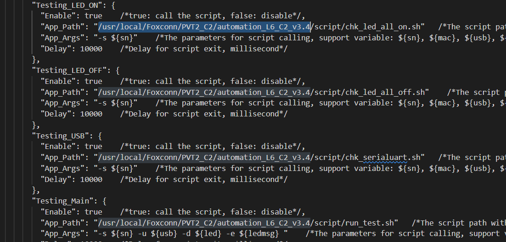
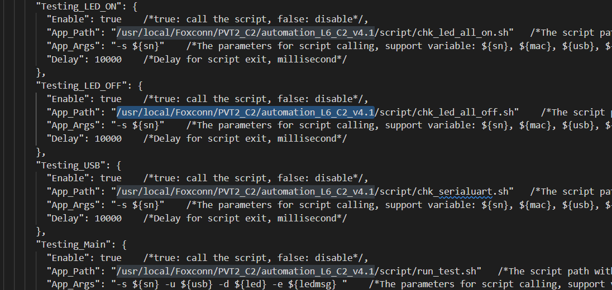

# Configuraciones

Existen múltiples configuraciones que permiten adecuar el comportamiento de Xandra a los cambios presentados tanto en requerimientos de calidad como el yield mínimo para bloquear un equipo, hasta agregar una nueva versión del script de pruebas.

El archivo de configuración principal de xandra se encuentra escrito en formato `JSON` estándar y está localizado en la raíz del proyecto, se le puede localizar con el nombre `xandra_config.json`.

!!! tip
    Para abrir el archivo de configuración de xandra en modo edición puede ingresar el comando `xandra-config` en una terminal.

## Listado de configuraciones

`fixtureIpEnvironmentName`: Nombre de la variable del entorno en la cuál se inyectará la ip de la fixtura al iniciar su terminal. **Se recomienda no modificar esta configuración a menos que sea estrictamente necesario**.

`fctHostControl`: Arreglo con configuraciones de los archivos FCTHostControl y FCTHostControl.config (ver sección acerca de [agregar nueva versión de script](#agregar-nueva-version-del-script-de-pruebas)).

`fctHostControl.path`: Ruta a la carpeta donde se contienen los archivos FCTHostControl y FCTHostControl.config.

`fctHostControl.executable`: Nombre del archivo ejecutable FCTHostControl.

`fctHostControl.config`: Nombre del archivo de configuración FCTHostControl.config

`defaultProductModelName`: Nombre del modelo seleccionado por defecto en FCTHostControl.config (se procesa como expresión regular)

`uploadSfcScript`: Ruta completa al script encargado de subir la trazabilidad al sistema SFC en modo [sólo reportar a sistema tarjetas buenas](modes.md).

`logsPath`: Ruta donde se guardan los logs de las pruebas realizadas.

`yieldErrorThreshold`: **[0-100; 0 = deshabilitado]** - Porcentaje de yield el cual una vez alcanzado bloqueará la fixtura y la pintará de color rojo en la interfaz.
 
`yieldWarningThreshold`: **[0-99]** - Porcentaje de yield el cual una vez alcanzado pintará la fixtura de color amarillo en la interfaz.

`yieldCalcQty`: **[0-1000]** - Cantidad de pruebas con las que se calculará el yield.

`unlockPassQty`: **[1-5]** - Cantidad de pruebas consecutivas con estatus PASS necesarias para desbloquear la fixtura.

`lockFailQty`: **[0-10; 0 = deshabilitado]** - Cantidad de pruebas consecutivas con estatus FAILED necesarias para bloquear la fixtura.

`googleSheets`: Configuración para subir resultados de las pruebas realizadas a google sheets (ver sección acerca de [google sheets](#hoja-de-calculo-de-google-sheets)). 

`googleSheets.isActivated`: Valor booleano para activar (true) o desactivar (false) la subida de información a google sheets.

`googleSheets.sheetName`: Nombre de la hoja de google sheets donde se subirán los resultados de las pruebas.

`googleSheets.keyfilePath`: Ruta completa a la llave de acceso para la hoja de google sheets.

## Archivo de configuración predeterminado

``` json
{
    "fixtureIpEnvironmentName": "XANDRA_FIXTURE_IP",
    "fixtureIpEnvironmentName_description":"Variable del entorno en la cuál se inyectará la ip de la fixtura",

    "fctHostControl": [
        {
            "path": "/usr/local/Foxconn/automation/DA194/Bahubali_Sparrow_C3_4.2",
            "executable": "FCTHostControl",
            "config": "FCTHostControl.config"
        },
        {
            "path": "/usr/local/Foxconn/automation/DA194/Bahubali_Sparrow_C3",
            "executable": "FCTHostControl",
            "config": "FCTHostControl.config"
        }
    ],
    "fctHostControl_description":"Configuración de ruta completa a la carpeta que contiene los archivos FCTHostControl y FCTHostControl.config",

    "defaultProductModelName":  "^C4.*",
    "defaultProductModelName_description" : "Nombre del modelo seleccionado por defecto en FCTHostControl.config (se procesa como expresión regular)",

    "uploadSfcScript":  "/usr/local/Foxconn/automation/Xandra/Resources/up_sfc.sh",
    "uploadSfcScript_description" : "Ruta completa al script encargado de subir la trazabilidad al sistema SFC",

    "logsPath": "/log/diag",
    "logsPath_description":"Ruta donde se guardan los logs de las pruebas realizadas",

    "yieldErrorThreshold": 0,
    "yieldErrorThreshold_description": "[0-100; 0 = deshabilitado] - Porcentaje de yield el cual una vez alcanzado bloqueará la fixtura y lo pintará de color rojo en la interfaz (0 para deshabilitar)",

    "yieldWarningThreshold": 70,
    "yieldWarningThreshold_description": "[0-99] - Porcentaje de yield el cual una vez alcanzado pintará la fixtura de color amarillo en la interfaz",

    "yieldCalcQty": 10,
    "yieldCalcQty_description" : "[0-1000] - Cantidad de pruebas con las que se calculará el yield",

    "unlockPassQty": 1,
    "unlockPassQty_description" : "[1-5] - Cantidad de pruebas consecutivas con estatus PASS necesarias para desbloquear la fixtura",

    "lockFailQty": 3,
    "lockFailQty_description" : "[0-10; 0 = deshabilitado] - Cantidad de pruebas consecutivas con estatus FAILED necesarias para bloquear la fixtura",

    "googleSheets": {
        "isActivated" : true,
        "sheetName": "FBT Bahubali",
        "keyfilePath": "/usr/local/Foxconn/automation/Xandra/Static/yield-bahubali-f20f62671db6.json"
    },
    "googleSheets_description":"Configuración para subir resultados de las pruebas realizadas a google sheets"
}
```

## Agregar nueva versión del script de pruebas

Es importante distinguir entre la versión del secuenciador `FCTHostControl` y la versión del script de pruebas, existen múltiples versiones de ambos pero no todos son compatibles entre sí, es importante remarcar que a partir de la versión 4.2 del script de prueba el secuenciador `FCTHostControl` fue actualizado a la par para agregar nuevas funcionalidades, como el bloqueo de la fixtura tras cumplir una serie de condiciones de manera similar a como lo realiza Xandra.

La tabla de compatibilidad entre ambos elementos antes vistos es la siguiente:

FCTHostControl| Script
:---: | :---:
FCTHostControl | <=4.1
FCTHostControl 4.2 | 4.2>=

Según sea el caso es posible actualizar solamente la version del script que ejecutara el secuenciador o en su defecto actualizar el secuenciador mismo.

### Agregar nueva versión del script de pruebas 

Para actualizar la versión del script ejecutado por el secuenciador es necesario modificar el archivo `FCTHostControl.config` reemplazando en todos los campos la ruta del script actual por el nuevo:

!!! example

    * Ejemplo de script actual:
        

    * Ejemplo de script nuevo tras reemplazar todas las incidencias de la ruta del script viejo:
        

        ```diff
        - /usr/local/Foxconn/PVT2_C2/automation_L6_C2_v3.4
        + /usr/local/Foxconn/PVT2_C2/automation_L6_C2_v4.1
        ```

Una vez realizado lo anterior tanto Xandra como `FCTHostControl` reconocerán y utilizarán la versión del script especificada en el archivo de configuración, cabe mencionar que **es necesario reiniciar Xandra** para que los cambios se vean reflejados.

### Agregar nueva versión de `FCTHostControl`

Cuando sea necesario introducir una nueva versión del secuenciador `FCTHostControl` puede realizarse siguiendo estos pasos:

* Ejecutar el comando `xandra-config` para abrir el archivo de configuración.
* Agregar un nuevo objeto en la configuración `fctHostControl`, con los campos `path`, `executable` y `config`:

    !!! example

        ``` diff
        "fctHostControl": [
        +   {
        +       "path": "/usr/local/Foxconn/automation/DA194/Bahubali_Sparrow_C3_4.3",
        +       "executable": "FCTHostControl",
        +       "config": "FCTHostControl.config"
        +   },
            {
                "path": "/usr/local/Foxconn/automation/DA194/Bahubali_Sparrow_C3_4.2",
                "executable": "FCTHostControl",
                "config": "FCTHostControl.config"
            },
            {
                "path": "/usr/local/Foxconn/automation/DA194/Bahubali_Sparrow_C3",
                "executable": "FCTHostControl",
                "config": "FCTHostControl.config"
            }
        ]
        ```

* Guardar los cambios realizados en el archivo.

!!! note 
    Xandra valida de arriba hacia abajo la existencia de las carpetas especificadas en el arreglo y selecciona de forma automática la primera configuración válida que encuentre.

## Hoja de cálculo de google sheets

Se tiene la posibilidad de subir la información de las pruebas ejecutadas a una hoja de de google sheets, ésta actualmente se utiliza como base de datos para generar reportes y dashboards con Power BI para monitorear el desempeño de las fixturas.

Para lograr tal objetivo se hace uso de la api proporcionada por google, por lo que es necesario registrar un nuevo proyecto en la plataforma **google cloud platform** y obtener la llave de acceso en formato json para poder acceder a las hojas de calculo desde Xandra.

!!! note
    Para crear una nueva aplicación y una nueva llave de acceso puede seguir los pasos de [esta guía](https://towardsdatascience.com/turn-google-sheets-into-your-own-database-with-python-4aa0b4360ce7).

La configuración actual de google sheets está gestionada con la siguiente cuenta de google:

`usuario`: david.ascencio.foxconn@gmail.com

`contraseña`: Foxconn#231

## Cambiar ruta de logfiles

Xandra al ser un envoltorio de `FCTHostControl` no puede acceder de forma directa al resultado de las pruebas ejecutadas, por lo tanto, para obtener dicha información hace uso de `watchdogs` que informan sobre los eventos de creación, modificación y eliminación de archivos en la carpeta especificada, así pues, si no se configura de manera correcta la ruta en donde se guardan los logfiles de prueba, Xandra no podrá obtener dicha información y su funcionamiento será errático e indeseado.

Para establecer la ruta de logfiles de prueba basta con modificarla en el archivo de configuración:

* Ejecutar el comando `xandra-config` para abrir el archivo de configuración.
* Modifica la configuración `logsPath`.
  
    !!! example
        ```diff
        - "logsPath": "/log/diag",
        + "logsPath": "/log/new_path",
        ```
        
* Guarda los cambios generados en el archivo.
* Reinicia Xandra.

!!! note
    Es necesario reiniciar Xandra para que los cambios realizados a la ruta de logfiles surja efecto.