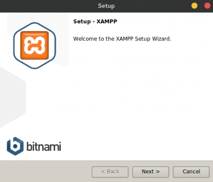

# Instalación

El programa Xandra está basado en python3 por ésta razón su interfaz gráfica utiliza como motor PyQt5, la persistencia de datos se realiza mediante MySQL cuyo motor es gestionado por XAMPP.

Como puede observarse Xandra tiene múltiples dependencias externas por lo que es necesario realizar la instalación de cada una de ellas para poder ejecutar el programa principal.

## Instalar XAMPP

XAMPP es una distribución de Apache completamente gratuita y fácil de instalar que contiene MariaDB, PHP y Apache Server. Se decidió utilizar el paquete de instalación de XAMPP debido a que ha sido diseñado para ser increíblemente fácil de instalar y utilizar.

Para instalar ésta distribución realice los siguientes pasos:

* Descargar XAMPP para Linux desde [https://www.apachefriends.org/es/index.html](https://www.apachefriends.org/es/index.html)
* Al terminar la descarga queda un archivo con extensión .run el cual debe ser instalado de la siguiente manera (donde xxx es la versión del archivo descargado):
    
    ``` shell
    sudo su
    ```
    ``` shell
    chmod +x xampp-linux-x64-xxx-installer.run
    ```
    ``` shell
    ./xampp-linux-x64-xxx-installer.run
    ```
    
    

* Aceptar todo y esperar a que termine la instalación.

## Crear servicio de XAMPP

La intención de crear un servicio para el paquete XAMPP es que éste sea inicializado automáticamente después de reiniciar el servidor. Para lograr éste objetivo se hace uso de `systemd` que es un sistema init y un administrador del sistema, considerado como el estándar para las distribuciones Linux e incluido por defecto en CentOS.

La finalidad principal de un sistema init es inicializar los componentes que deben ejecutarse tras arrancar el kernel Linux (tradicionalmente conocidos como componentes “userland”). El sistema init también se utiliza para administrar servicios y daemons para el servidor en cualquier momento mientras se ejecuta el sistema.

Para crear el servicio del paquete XAMPP es necesario realizar los siguientes pasos:

* Acceder a la carpeta contenedora de los servicios:

    ``` shell
    cd /etc/systemd/system/
    ```

* Crear un nuevo archivo llamado `xampp.service`:
    ``` shell
    touch xampp.service
    ```

* Abrir el archivo con un editor de texto gráfico:
    ``` shell
    gedit xampp.service
    ```

* Copiar y pegar el siguiente texto en el archivo `xampp.service`:

    ```
    [Unit]
    Description = Xampp server

    [Service]
    ExecStart =/opt/lampp/lampp start
    ExecStop =/opt/lampp/lampp stop
    Type=forking
    
    [Install]
    WantedBy = multi-user.target
    ```

* Guardar los cambios del archivo `xampp.service`.
* Habilitar el servicio para que XAMPP sea inicializado automáticamente en el arranque:

    ``` shell
    $ systemctl enable xampp.service
    ```

* Iniciar el servicio:

    ``` shell
    $ systemctl start xampp.service
    ```

* Validar que todo se ha inicializado correctamente: 
    ``` shell
    $ systemctl status xampp.service
    ```

* Se debe mostrar una salida similar a la siguiente:

    !!! success
        ```
        XAMPP: Starting Apache.../opt/lampp/share/xampp/xampplib
        /opt/lampp/share/xampp/xampplib
        ok.
        XAMPP: Starting MySQL.../opt/lampp/share/xampp/xampplib
        ok.
        XAMPP: Starting ProFTPD.../opt/lampp/share/xampp/xampplib
        ok.
        ```

!!! warning
    **Si aparece un error relacionado con libc.so.6, libdl.so.2** diríjase al apartado [solución de problemas](troubleshooting.md) para resolverlo.


## Crear base de datos

La base de datos es el componente principal para la persistencia de información utilizado por Xandra, en éste se almacenan los resultados de las pruebas realizadas, la configuración, el estado de cada fixtura, entre otros.

Para crear la base de datos `xandra_dbo` dentro de `MySQL` ejecute los siguientes comandos:

* Escriba en la terminal el comando para ejecutar el motor de la base de datos:

    ``` shell
    $ /opt/lampp/bin/mysql -u root
    ```

* Se iniciara la consola de `MariaDB` y mostrara una información similar a la siguiente:

    ```
    Welcome to the MariaDB monitor.  Commands end with ; or \g.
    Your MariaDB connection id is 9
    Server version: 10.4.27-MariaDB Source distribution

    Copyright (c) 2000, 2018, Oracle, MariaDB Corporation Ab and others.

    Type 'help;' or '\h' for help. Type '\c' to clear the current input statement.

    MariaDB [(none)]> 
    ```

* Introduzca el siguiente comando para crear el esquema `xandra_dbo`:

    ``` sql
    CREATE DATABASE IF NOT EXISTS xandra_dbo;
    ```

* Si la respuesta es semejante a la que se muestra a continuación, el procedimiento fue realizado correctamente:

    !!! success
        MariaDB [(none)]> CREATE DATABASE IF NOT EXISTS xandra_dbo;

        Query OK, 1 row affected (0.039 sec)


## Instalar dependencias del sistema

Xandra tiene dependencias externas relacionadas con el sistema operativo, las mismas son instaladas mediante el gestor de paquetes propio de CentOS, es decir, yum.

Para instalar dichas dependencias es necesario contar con una conexión estable a internet debido a que los repositorios en los que se encuentran alojadas sólo son accesibles a través de éste medio.

* Para instalar las dependencias del sistema ejecute el siguiente comando:

    ``` shell
    sudo yum install -y tmux xterm
    ```

## Agregar comandos alias al sistema

Los alias son similares, salvando las distancias, a los accesos directos de Windows. Permiten representar un comando o conjunto de comandos asociándolos con una palabra clave dentro de la terminal. Su uso principal es el de abreviar órdenes o añadir argumentos de forma predeterminada a una orden que se usa con mucha frecuencia.

Para agregar los alias de Xandra realice los siguientes pasos:

* Modificar archivo `~/.bashrc`:

    ``` shell
    gedit ~/.bashrc
    ```

* Copiar y pegar el siguiente texto al final del archivo `~/.bashrc`:

    ``` shell
    if [ -f ~/.bash_aliases ]; then
    . ~/.bash_aliases
    fi
    ```

* Guardar los cambios.

* Crear archivo `~/.bash_aliases`:
   
    ``` shell
    touch ~/.bash_aliases
    ```

* Abrir en el editor de texto gráfico al archivo `~/.bash_aliases`:
   
    ``` shell
    gedit ~/.bash_aliases
    ```

* Copiar y pegar el siguiente texto en el archivo `~/.bash_aliases`:

    ```
    # Set environment variables
    export XANDRA_BASE_PATH=/usr/local/Foxconn/automation/Xandra
    export XANDRA_MAIN_SCRIPT=$XANDRA_BASE_PATH/xandra.py

    # Alias to open Xandra
    alias xandra='systemctl start xampp.service && tmux new -d "cd $XANDRA_BASE_PATH && python3 $XANDRA_MAIN_SCRIPT"'

    # Alias to open Xandra in testing mode
    alias xandra-testing='ENV=testing python3 $XANDRA_MAIN_SCRIPT'

    # Alias to open Xandra config
    alias xandra-config='tmux new -d "gedit $XANDRA_BASE_PATH/xandra_config.json"'

    # Alias to cd Xandra path
    alias xandra-path='cd $XANDRA_BASE_PATH'

    # Alias to update Xandra
    alias xandra-update='sudo chmod +x $XANDRA_BASE_PATH/update.sh && $XANDRA_BASE_PATH/update.sh'

    # Alias to kill Xandra
    alias xandra-kill='fuser $XANDRA_MAIN_SCRIPT 2> /dev/null | xargs kill'

    # Alias to open docs
    alias xandra-docs='gio open $XANDRA_BASE_PATH/docs/index.html'
    ```

* Guardar los cambios.

* Ejecutar comando para cargar los alias a la terminal:
   
    ``` shell
    source ~/.bash_aliases
    ```
  
!!! warning
    En ocasiones es necesario reiniciar la terminal para poder ejecutar los comandos alias de Xandra.
   
!!! tip
    La lista completa de comandos se puede consultar en la sección [comandos](commands.md).

## Clonar repositorio de Github

El proyecto Xandra se encuentra alojado en el servidor Github.com para facilitar la gestión de versiones y su distribución.

Al clonar un repositorio se extrae una copia integral de todos los datos del repositorio que GitHub.com tiene en ese momento, incluidas todas las versiones de cada archivo y carpeta del proyecto.

* Para clonar el programa Xandra a la computadora local ejecute los siguientes comandos:

    ```
    mkdir /usr/local/Foxconn/automation
    ```
    ```
    cd /usr/local/Foxconn/automation
    ```
    ```
    git clone https://github.com/David1906/Xandra.git
    ```

## Instalar dependencias python

Pip es un sistema de gestión de paquetes utilizado para instalar y administrar paquetes de software escritos en Python. Xandra hace uso de dichos paquetes para enriquecer su funcionalidad proveyéndolo de características tales como una interfaz gráfica.

* Para instalar las dependencias de python ejecute los siguientes comandos:

    ```
    pip3 install -r requirements.txt
    ```
    ```
    pip3 uninstall alembic
    ```
    ```
    python3 -m pip install alembic --user
    ```

## Crear acceso directo

En Gnu/Linux es fácil crear accesos directos personalizados que estén registrados por el escritorio y que los muestre en donde corresponda de manera automática, para ello solo hemos de crear un archivo .desktop con la configuración necesaria dentro de la carpeta correspondiente.

En el caso de Xandra dicho acceso directo se crea en la carpeta Desktop del usuario root, para ello realice los siguientes pasos:

* Crear archivo `xandra.desktop`:

    ```
    touch /root/Desktop/xandra.desktop
    ```

* Abrir en el editor de texto gráfico al archivo `xandra.desktop`:
    ```
    gedit /root/Desktop/xandra.desktop
    ```

* Copiar y pegar el siguiente texto en el archivo `xandra.desktop`:

    ```
    [Desktop Entry]
    Name=Xandra
    Exec=xandra
    Terminal=true
    Type=Application
    Icon=/usr/local/Foxconn/automation/Xandra/Static/icon.png
    ```

* Guardar los cambios.

* Una vez realizados los pasos anteriores debe aparecer un acceso directo en el escritorio del usuario root con el ícono de Xandra.

!!! tip
    También es posible abrir el programa Xandra ejecutando el comando `xandra` en una terminal.


## Correr script de actualización

Xandra cuenta con un script especializado en buscar, descargar y configurar las nuevas versiones lanzadas del mismo, para ello basta con ejecutar el comando `xandra-update` en una terminal.

```
xandra-update
```

## Validar configuración
Antes de iniciar Xandra es importante validar la configuración por defecto incluida en la versión actual, para ello ejecuta el comando `xandra-config`, si requiere ver la descripción de cada configuración diríjase a la sección [configuraciones](configs.md).

```
xandra-config
```

!!! warning
    Cada vez que se ejecuta el comando `xandra-update` el archivo de configuración es regresado a sus valores por defecto.