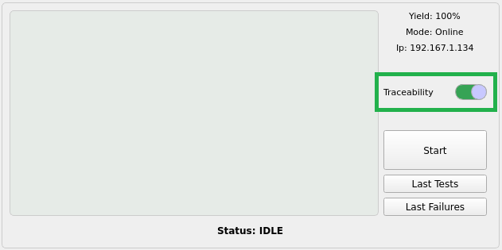
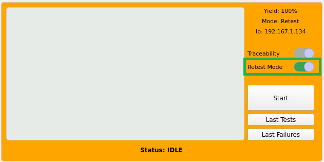
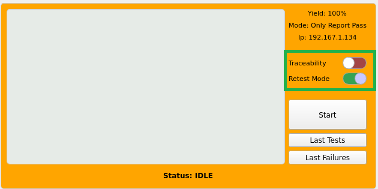
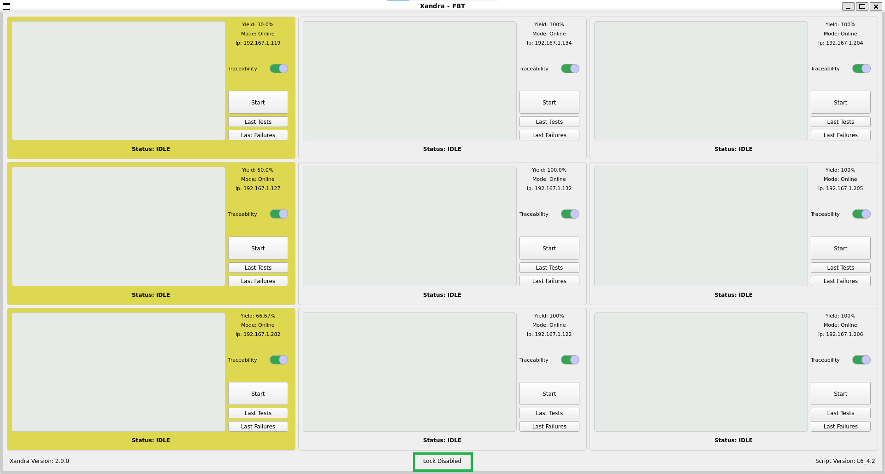

# Modos de operación

Xandra cuenta con múltiples modos de operación cuyo objetivo es atacar las necesidades específicas según el contexto de producción actual intentando obtener la mejor utilización de las fixturas disponibles mientras se cuida el yield y se maximizan las unidades producidas por hora.

Los modos disponibles son `En línea`, `Fuera de línea`, `Retest`, `Only Report Pass` cuyo comportamiento puede observarse en la siguiente tabla:

Modo | Bloqueo | SFC Pass | SFC Fail 
:--- | :---: | :---: | :---:
En línea | ✅ | ✅ | ✅
Fuera de línea | ❌ | ❌ | ❌
Retest | ❌ | ✅ | ✅ |
Only Report Pass | ✅ | ✅ | ❌

`Bloqueo`: Si la fixtura cumple las [condiciones de bloqueo](operation.md#logica-para-el-bloqueo-de-fixturas) ésta no permite probar más tarjetas hasta que sus condiciones sean optimas nuevamente.

`SFC Pass`: Reporta en SFC las tarjetas que pasan las pruebas.

`SFC Fail`: Reporta en SFC las tarjetas que fallan las pruebas.

## En línea (trazabilidad activa)

En este modo se ejecuta el sistema `FCTHostControl` con la trazabilidad habilitada, por lo tanto cada que falle o pase una tarjeta ésta se verá reflejada en el sistema SFC.

!!! info
    Para activar éste modo **activa** el selector **Traceability**

    


El comando con el que se inicia el secuenciador `FCTHostControl` es similar al siguiente:

``` shell
cd /local/Foxconn/automation/DA194/Bahubali_Sparrow && XANDRA_FIXTURE_IP=192.167.1.119 /local/Foxconn/automation/DA194/Bahubali_Sparrow/FCTHostControl -f 1
```

!!! info
    Al abrir Xandra De forma predeterminada éste es el modo en el que se encuentran configuradas todas las fixturas.

## Fuera de línea (trazabilidad inactiva)

En este modo Xandra inicia el `FCTHostControl` agregando un `-m` al final del comando para correr el secuenciador fuera de linea, es decir, no se verá reflejado en SFC el resultado de la prueba ya sea éste un pase o una falla.

!!! info
    Para activar éste modo **desactiva** el selector **Traceability**

    

El comando con el que se inicia el secuenciador `FCTHostControl` es similar al siguiente (con -m al final):

``` shell
cd /local/Foxconn/automation/DA194/Bahubali_Sparrow && XANDRA_FIXTURE_IP=192.167.1.119 /local/Foxconn/automation/DA194/Bahubali_Sparrow/FCTHostControl -f 1 -m
```

## Retest (Retrabajo)

El modo retest está pensado para probar tarjetas que provienen de reparación, debido a que éstas normalmente cuentan con fallas reales es muy probable que fallen afectando el yield de la fixtura. Para prevenir el bloqueo ocasionado por fallas reales es posible activar este modo donde la trazabilidad está activa, pero el resultado de las pruebas no es tomado en cuenta para el calculo del yield.

!!! info
    Para activar éste modo es necesario realizar los siguientes pasos:

    - Presionar atajo de teclas `Ctrl+Shift+G`.
    - **Activar** el selector **Retest Mode**.

    

!!! note
    Al activar el modo **Retest** el selector de trazabilidad se deshabilita automáticamente y viceversa.

!!! warning
    Si al desactivar el modo de `Retest` se cumple una de las condiciones en la [lógica de bloqueo](operation.md#logica-para-el-bloqueo-de-fixturas) la fixtura se bloqueará automáticamente y tendrá que ser desbloqueada para activar de nuevo el modo `Retest`.

El comando con el que se inicia el secuenciador `FCTHostControl` es similar al siguiente:

``` shell
cd /local/Foxconn/automation/DA194/Bahubali_Sparrow && XANDRA_FIXTURE_IP=192.167.1.119 /local/Foxconn/automation/DA194/Bahubali_Sparrow/FCTHostControl -f 1
```

## Only Report Pass (sólo reportar a SFC tarjetas buenas)

Cuando está activado este modo, el sistema `FCTHostControl` es ejecutado fuera de línea (con -m al final) por lo que el secuenciador no reportará a SFC el resultado de la prueba, no obstante, Xandra de manera externa utilizando el script indicado en la configuración `uploadSfcScript` sube al sistema de trazabilidad el pase de dicho número de serie, dando como resultado que no se reporten en SFC las fallas mientras que las tarjetas aprobadas sí se verán reflejadas en el sistema.

!!! info
    Para activar éste modo es necesario realizar los siguientes pasos:

    - Presionar atajo de teclas `Ctrl+Shift+G`.
    - **Activar** el selector **Retest Mode**.
    - Presionar atajo de teclas `Ctrl+Shift+T`.
    - Ingresar la contraseña (el ingeniero a cargo debe conocerla).
    - **Desactivar** el selector **Traceability**.

    

!!! danger
    Este modo está pensado para ser utilizado únicamente en fixturas específicas donde su yield es demasiado bajo pero aún así se desea ingresar tarjetas al mismo y no afectar al yield general. **Se desaconseja completamente el uso generalizado de este modo**.

## Deshabilitar bloqueo

Si se habilita ésta opción, el bloqueo de las fixturas quedará deshabilitado en todos los modos de operación.

!!! info
    Para deshabilitar el bloqueo de fixturas es necesario realizar los siguientes pasos:

    - Presionar atajo de teclas `Ctrl+Shift+L`.
    - Ingresar la contraseña (el ingeniero a cargo debe conocerla).
    - Verificar que al pie de la ventana principal aparezca la leyenda `Lock Disabled`.

    

!!! danger
    Utilice con cuidado ésta opción ya que las fixturas con bajo rendimiento seguirán aceptando tarjetas para ser probadas, lo que puede impactar generando un bajo yield junto con una reducción de las unidades por hora producidas.

    Históricamente se han presentado casos donde una fixtura llega a fallar hasta 17 tarjetas NDF seguidas.