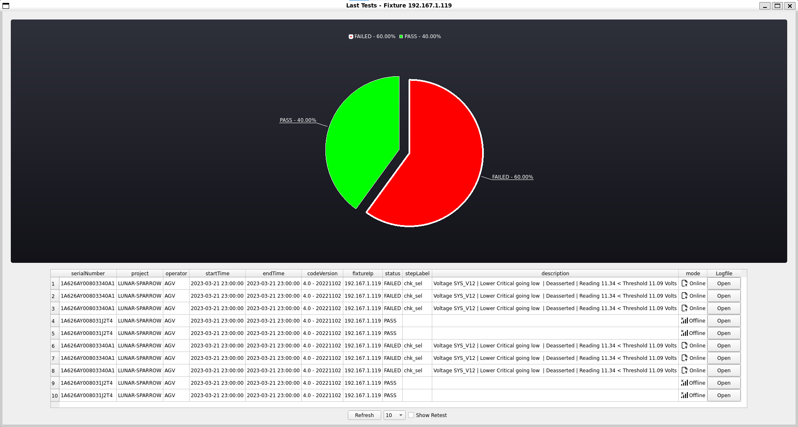
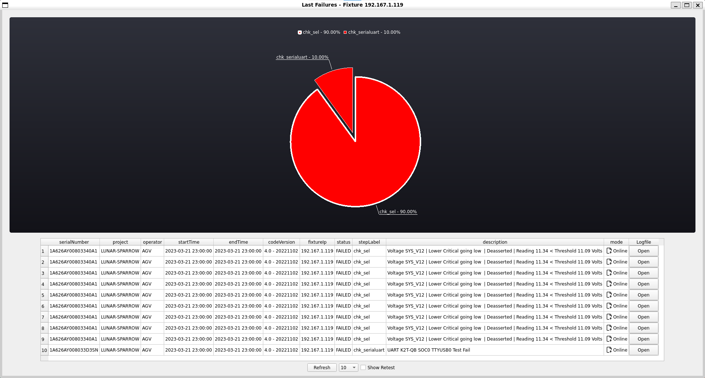
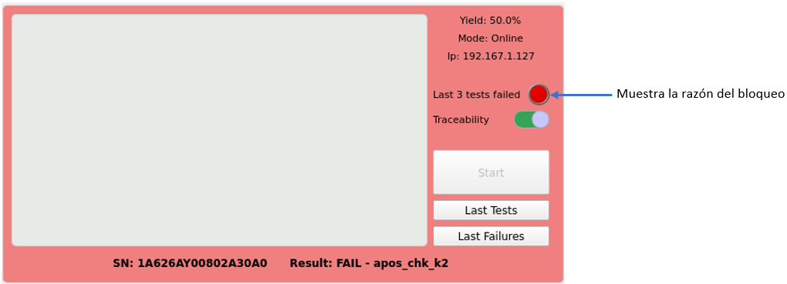

# Operación Básica

## Abrir Xandra

En el escritorio de cada servidor de prueba (PXE) se encuentra el ícono de la aplicación, al dar doble click sobre éste se abrirá una nueva ventana del programa, es importante señalar que Xandra está diseñado para solo abrir una ventana a la vez por lo que es posible que se encuentre con un mensaje de error al intentar ejecutarlo.

De forma alternativa es posible ejecutar el comando `xandra` en una terminal para lanzar una nueva ventana.

!!! info
    Si obtiene un error al intentar abrir el programa diríjase a la sección [solución de problemas](troubleshooting.md#xandra-no-permite-abrir-nueva-ventana) para intentar encontrar un arreglo a la situación.

## Componentes de la ventana principal

La ventana principal muestra un arreglo de 9 componentes dispuestos de forma idéntica a como pueden ser localizadas físicamente las fixturas sobre los racks, cuenta con 3 columnas de 3 fixturas cada una. 

En la parte inferior puede apreciarse la versión de Xandra, la versión del script de pruebas que está siendo utilizado, así como el estado general del programa.

Sus partes principales son las siguientes:


## Componentes de la fixtura

Cada fixtura se encuentra representada en la ventana principal por un componente gráfico cuya finalidad es facilitar la visualización del estado y configuración de la misma. Todos los componentes pueden ajustarse y manipularse de manera independiente debido a que todos sus procesos se ejecutan en hilos separados para garantizar un aislamiento concurrente adecuado.

Sus componentes son los siguientes:


## Iniciar FCTHostControl en la fixtura

Para iniciar el secuenciador `FCTHostControl` en una fixtura basta con presionar el botón `Start` y Xandra iniciará una nueva terminal con la configuración correspondiente.

!!! tip
    Si presionas el atajo de teclado `Ctrl+Shift+A` puedes inicializar todas las fixturas al mismo tiempo.

* Una vez inicializada la terminal seleccione el modelo que desea correr:

    

* Cuando la fixtura esté lista para recibir tarjeta se mostrará el siguiente mensaje:

    

!!! note
    Revise los [modos de operación](modes.md) para tener conocimiento de cuál será el comportamiento de la fixtura según su configuración actual.

## Detener FCTHostControl en la fixtura

Existen tres formas distintas para detener la terminal en una fixtura.

### Botón stop

* Presiona el botón `Stop` localizado en la parte superior de la fixtura.

### Detener todas las fixturas

* Es posible detener todas las fixturas al mismo tiempo utilizando el atajo de teclas `Ctrl+Shift+S`.

### Cerrar la terminal

* Haz click sobre la terminal de la fixtura que deseas detener.
* Presiona el atajo de teclas `Ctrl+C`.

!!! tip
    Se recomienda siempre utilizar el botón `Stop` para detener la terminal de una fixtura ya que de esta manera se evita finalizar alguna prueba por accidente.

## Estadísticas de últimas pruebas realizadas

Para visualizar un reporte de las últimas pruebas ejecutadas puedes hacer click en el botón `Last Test`, en ésta ventana se encuentra un gráfico de pastel indicando el porcentaje de pruebas aprobadas y falladas, así como una tabla con el resumen de cada una de ellas.

En la última columna de la tabla se encuentra un botón con el cual puedes acceder directamente al logfile completo de la prueba para ver en detalle el resultado de cada paso ejecutado durante su ejecución.



### Mostrar sólo pruebas que afectan al cálculo del yield

Cuando la fixtura se encuentra en ciertos modos, las pruebas realizadas no se ven reflejadas en el cálculo del yield, por ejemplo cuando se activa el `modo retest` o `modo fuera de línea` ([ver sección modos para mayor información](modes.md#modos-de-operación)) por lo tanto si desea visualizar sólo aquellas pruebas que son tomadas en cuenta para dicho cálculo basta con seleccionar el checkbox `Show only records that count in yield` localizado en la parte inferior de la ventana.

## Incrementar o disminuir la cantidad de pruebas visualizadas

Si requiere visualizar un número diferente de registros puede seleccionar la cantidad que mejor se adecúe a sus necesidades en el combobox ubicado sobre la parte inferior de la ventana. Los valores posibles son `10`, `25`, `50`, `100`,`200`.

!!! info
    La cantidad por defecto del combobox es la que mejor se adecúe a la configuración `yieldCalcQty`.

### Columna Description

En esta columna se guarda una síntesis de la causa por la cual falló la prueba, listando errores como problemas de dimm o el voltaje que provocó dicho comportamiento inesperado.

### Columna Traceability

En esta columna se especifica si la prueba fue ejecutada con trazabilidad activa, es decir, si su resultado fue reflejado en el sistema SFC. Si la columna contiene una palomita significa que la trazabilidad se encontraba activa al momento de ejecutar la prueba, de lo contrario, ésta característica estaba deshabilitada.

### Columna Count In Yield

Esta columna indica si la prueba está siendo tomada en cuenta para el cálculo del yield, su valor es calculado en base al modo con el cuál fue ejecutada la prueba. Si la columna contiene una palomita significa que el resultado está siendo considerado para el calculo del yield, de lo contrario, está siendo ignorada.

## Estadísticas de últimas fallas

Si requiere visualizar un reporte con las últimas fallas presentadas en la fixtura presione el botón `Last Failures`, en ésta ventana se encuentra un gráfico de pastel indicando las fallas y su porcentaje de incidencia según su clasificación (stepLabel), así como una tabla con el resumen de cada una de ellas.

El objetivo de ésta ventana es identificar las fallas que está teniendo la fixtura para realizar un mejor mantenimiento preventivo y correctivo.



!!! nota
    Tanto la tabla como los controles en la parte inferior de esta ventana funcionan de la misma manera que la ventana **Estadísticas de últimas pruebas realizadas**.

## Lógica para el bloqueo de fixturas

Una de las razones de ser de Xandra es la posibilidad de bloquear el uso de una fixtura basado en una serie de reglas previamente establecidas.

Actualmente la fixtura es bloqueada si se cumple una de 2 condiciones:

1. El yield es más bajo que lo especificado en la configuración `yieldErrorThreshold`.
2. La fixtura falló de manera consecutiva la cantidad de pruebas especificadas en la configuración `lockFailQty`.

Una vez que se cumple alguna de las dos condiciones, al ingresar una tarjeta de prueba la fixtura abortará la prueba de forma automática hasta que nuevamente se encuentre en condiciones óptimas para operar. La fixtura bloqueada puede ser identificada fácilmente pues su control es pintado de color rojo para indicar visualmente dicho estado, como se muestra en la siguiente imagen:



El bloqueo de la fixtura se realiza al ejecutar un script de comprobación desde el sistema `FCTHostControl`, mismo que se puede establecer en su archivo de configuración `FCTHostControl.config` en la sección `Check_Station`. De forma automática Xandra sobre-escribe la configuración antes mencionada para ejecutar el script `Resources/chk_station_is_disabled.py` antes de cada prueba. 

!!! example 
    ``` json
    "Check_Station": {
        "Enable": true /*true: call the script, false: disable*/,
        "App_Path": "/usr/local/Foxxcon/automation/Xandra/Resources/chk_station_is_disabled.py" ,
        "App_Args": ""		/*The parameters for script calling, support variable: ${sn}, ${mac}, ${usb}, ${led}, ${ledmsg}*/,
        "Delay": 5000 /*Delay for script exit, millisecond*/
    },
    ```

### Script chk_station_is_disabled.py

Este script se comunica mediante "websocket" con el programa principal de Xandra para obtener el estado actual de la fixtura desde el que es invocado, para obtener dicha información el script lee la variable de entorno con el nombre especificado en la configuración `fixtureIpEnvironmentName`, tras lo anterior envía una petición a Xandra solicitando el estado actual de dicha fixtura, para informar a `FCTHostControl` si debe continuar o no la prueba se hace uso del estado de salida `exit(0)` significa que la fixtura está funcionando correctamente y por lo tanto debe continuar con la prueba, por el contrario, si el estado es `exit(1)` la señal es que aborte la prueba.

!!! warning
    Si no se configura correctamente el archivo `FCTHostControl.config` para ejecutar el script `chk_station_is_disabled.py`, Xandra no podrá bloquear la fixtura.

## Lógica para el desbloqueo de fixturas

Una vez bloqueada la fixtura existen 2 posibilidades para desbloquearla:

1. Subir el yield por encima de lo especificado en la configuración `yieldErrorThreshold`.
2. La fixtura pasa de manera consecutiva la cantidad de pruebas especificadas en la configuración `unlockPassQty`.

Una vez cumplida una de las dos condiciones el control de la fixtura remueve el color rojo del mismo.

## Detección de resultados

Xandra detecta los resultados al escuchar la carpeta especificada en la configuración `logsPath`, cada que se crea un nuevo archivo en esta ruta su contenido es procesado y almacenado, de igual manera se ve reflejado en la interfaz gráfica afectando el estado de la fixtura asociada al resultado de la prueba detectada.

## Detección de final de la prueba

Al ser Xandra una envoltura de `FCTHostControl` la única manera disponible de detectar el final de una prueba es mediante la detección de un archivo de registro (logfile) o mediante la ejecución de un script configurado en la sección `Test_End_Call` del archivo `FCTHostControl.config`, ésta configuración se escribe de manera automática al iniciar Xandra.

!!! example 
    ``` json
    "Test_End_Call": {
        "Enable": true /*true: call the script, false: disable*/,
        "App_Path": "/usr/local/Foxconn/automation/Xandra/Resources/chk_station_test_finished.py" ,
        "App_Args": ""		/*The parameters for script calling, support variable: ${sn}, ${mac}, ${usb}, ${led}, ${ledmsg}*/,
        "Delay": 5000 /*Delay for script exit, millisecond*/
    },
    ```

El script ejecutado es `Resources/chk_station_test_finished.py` el cual informa mediante "websocket" a Xandra que la fixtura con cierta ip terminó su prueba.