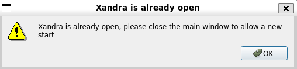
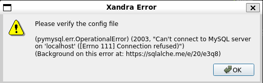

# Solución de problemas

## Xandra no permite abrir nueva ventana

Xandra sólo permite tener una ventana abierta a la vez debido a que utiliza tecnologías como websockets cuyo proceso está ligado a un puerto en particular (5001), de igual manera se pretende evitar la duplicidad de consolas ejecutando `FCTHostControl` para prevenir problemas con la ejecución de las pruebas. No obstante este diseño tiene como inconveniente que si el proceso principal de Xandra se queda congelado en segundo plano, Xandra no permitirá abrir una nueva ventana.

!!! failure
    ```
    [Errno 98] Address already in use
    ```    

    ```
    Xandra is already open, please close the main window to allow a new start
    ```  

    

Para solucionar éste problema es necesario matar el proceso principal de Xandra, ejecute los siguientes comandos para realizar tal cometido:

* Ingresar a la carpeta raíz de Xandra:

    ```
    xandra-path
    ```

* Obtener PID (process id) de xandra:

    ``` shell
    fuser xandra.py
    ```

    !!! info
        * Si se muestra como resultado un número entero, entonces xandra se encuentra ejecutándose en segundo plano.

        ```
        fuser xandra.py
        /usr/local/Foxconn/automation/Xandra/xandra.py:  2326
        ```

* Matar el proceso de xandra:

    ```
    fuser xandra.py 2> /dev/null | xargs kill
    ```

!!! tip
    Puede utilizarse el comando `xandra-kill` el cual ejecuta los pasos mencionados anteriormente de forma automática.

## Todas las terminales se quedan esperando el USB

En ocasiones todas las terminales se quedan esperando a que se liberen los puertos usb, ésto se puede solucionar o bien iniciando todas las terminales en caso de que una no lo esté, desatorando físicamente una fixtura trabada y en un caso extremo copiando y pegando nuevamente la carpeta que contiene al `FCTHostControl` para posteriormente reiniciar Xandra.

* Ejecutar el comando `xandra-config` en una terminal:

    ```
    xandra-config
    ```

* Identificar la configuración `fctHostControl` para poder ubicar la localización de la carpeta del `FCTHostControl`.

    !!! example
        ```
        fctHostControl": [
                {
                    "path": "/usr/local/Foxconn/automation/DA194/Bahubali_Sparrow_C3_4.2",
                    "executable": "FCTHostControl",
                    "config": "FCTHostControl.config"
                },
                {
                    "path": "/usr/local/Foxconn/automation/DA194/Bahubali_Sparrow_C3",
                    "executable": "FCTHostControl",
                    "config": "FCTHostControl.config"
                }
            ],
        ```

* Copiar y pegar la carpeta contenedora del `FCTHostControl` `fctHostControl.path` para crear una copia dentro de la misma ubicación.
* Eliminar la carpeta original.
* Renombrar la carpeta copia para que coincida con la configuración `fctHostControl.path`.
* Reiniciar Xandra.

## Error al conectarse con la base de datos

Si se muestra una ventana con  el error mostrado a continuación, es necesario iniciar Xampp para ejecutar correctamente Xandra.

!!! failure
    ```
    (pymysql.err.OperationalError) (2003, "Can't connect to MySQL server on 'localhost' ([Errno 111 Connection refused)")
    (Background on this error at: https://sqlalche.me/e/20/e3q8)
    ```    

    

* Ejecutar los siguientes comandos:
    ``` shell
    sudo systemctl start xampp.service
    ```
    ``` shell
    sudo systemctl status xampp.service
    ```

!!! failure
    Si tras ejecutar los comandos anteriores se muestra un error relacionado con **libc.so.6** o **libdl.so.2**, realiza los pasos de la sección **Xamp no inicia** para resolverlo.


## Xampp no inicia (problema libc.so.6, libdl.so.2)

Si se muestra un error similar al siguiente, siga los pasos mostrados a continuación para poder ejecutar Xampp dentro de CentOS:

```
** (gedit:10150): WARNING **: 10:15:59.822: Set document metadata failed: Setting attribute metadata::gedit-position not supported
[root@localhost ~]# sudo /opt/lampp/lampp start
/bin/sh: error while loading shared libraries: libdl.so.2: cannot open shared object file: No such file or directory
/bin/sh: error while loading shared libraries: libdl.so.2: cannot open shared object file: No such file or directory
/bin/bash: error while loading shared libraries: libdl.so.2: cannot open shared object file: No such file or directory
/bin/sh: error while loading shared libraries: libdl.so.2: cannot open shared object file: No such file or directory
/opt/lampp/bin/gettext: error while loading shared libraries: libc.so.6: cannot open shared object file: No such file or directory
id: error while loading shared libraries: libc.so.6: cannot open shared object file: No such file or directory
/opt/lampp/share/xampp/xampplib: line 11: test: -ne: unary operator expected
/opt/lampp/bin/gettext: error while loading shared libraries: libc.so.6: cannot open shared object file: No such file or directory
XAMPP: cat: error while loading shared libraries: libc.so.6: cannot open shared object file: No such file or directory
/bin/sh: error while loading shared libraries: libdl.so.2: cannot open shared object file: No such file or directory
rm: error while loading shared libraries: libc.so.6: cannot open shared object file: No such file or directory
netstat: error while loading shared libraries: libc.so.6: cannot open shared object file: No such file or directory
/bin/sh: error while loading shared libraries: libdl.so.2: cannot open shared object file: No such file or directory
netstat: error while loading shared libraries: libc.so.6: cannot open shared object file: No such file or directory
/bin/sh: error while loading shared libraries: libdl.so.2: cannot open shared object file: No such file or directory
/opt/lampp/bin/gettext: error while loading shared libraries: libc.so.6: cannot open shared object file: No such file or directory
/opt/lampp/bin/httpd: error while loading shared libraries: librt.so.1: cannot open shared object file: No such file or directory
/opt/lampp/bin/gettext: error while loading shared libraries: libc.so.6: cannot open shared object file: No such file or directory
XAMPP: hostname: error while loading shared libraries: libnsl.so.1: cannot open shared object file: No such file or directory
netstat: error while loading shared libraries: libc.so.6: cannot open shared object file: No such file or directory
/bin/sh: error while loading shared libraries: libdl.so.2: cannot open shared object file: No such file or directory
/opt/lampp/bin/gettext: error while loading shared libraries: libc.so.6: cannot open shared object file: No such file or directory
/bin/sh: error while loading shared libraries: libdl.so.2: cannot open shared object file: No such file or directory
/opt/lampp/bin/gettext: error while loading shared libraries: libc.so.6: cannot open shared object file: No such file or directory
XAMPP: cat: error while loading shared libraries: libc.so.6: cannot open shared object file: No such file or directory
/bin/sh: error while loading shared libraries: libdl.so.2: cannot open shared object file: No such file or directory
rm: error while loading shared libraries: libc.so.6: cannot open shared object file: No such file or directory
netstat: error while loading shared libraries: libc.so.6: cannot open shared object file: No such file or directory
/bin/sh: error while loading shared libraries: libdl.so.2: cannot open shared object file: No such file or directory
/opt/lampp/bin/gettext: error while loading shared libraries: libc.so.6: cannot open shared object file: No such file or directory
/opt/lampp/bin/gettext: error while loading shared libraries: libc.so.6: cannot open shared object file: No such file or directory
```

* Abrir archivo principal de xampp:
 
    ``` shell
    sudo gedit /opt/lampp/lampp
    ```

* Modificar la línea `export LD_ASSUME_KERNEL=2.2.5` a `export LD_ASSUME_KERNEL=2.8.0`:
  
    ``` diff
    - export LD_ASSUME_KERNEL=2.2.5
    + export LD_ASSUME_KERNEL=2.8.0
    ```

* Guardar los cambios realizados en el archivo.
* Ejecutar los siguientes comandos:
    ``` shell
    $ sudo systemctl start xampp.service
    ```
    ``` shell
    $ sudo systemctl status xampp.service
    ```

* Debe mostrarse una salida similar a la siguiente:

    !!! success
        ```
        XAMPP: Starting Apache.../opt/lampp/share/xampp/xampplib
        /opt/lampp/share/xampp/xampplib
        ok.
        XAMPP: Starting MySQL.../opt/lampp/share/xampp/xampplib
        ok.
        XAMPP: Starting ProFTPD.../opt/lampp/share/xampp/xampplib
        ok.
        ```