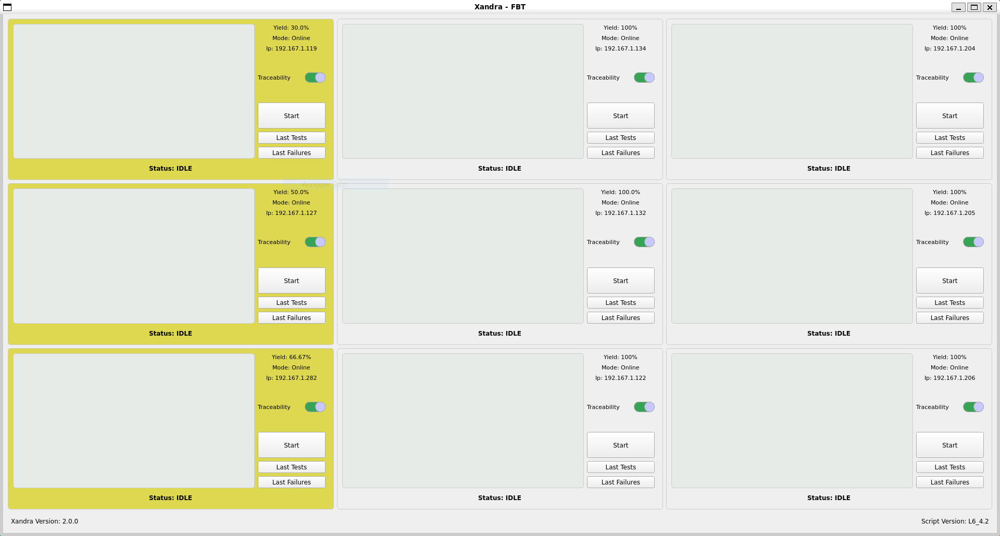

# Xandra

Xandra es una envoltura al secuenciador FCTHostControl intencionado a controlar y monitorear el yield de cada fixtura asociada con un servidor PXE, en consecuencia cuenta con múltiples herramientas para facilitar el mantenimiento y depuración de fallas relacionadas con el producto Lunar Bahubali.

Para ver la documentación completa ingrese al link [https://david1906.github.io/Xandra/](https://david1906.github.io/Xandra/)

